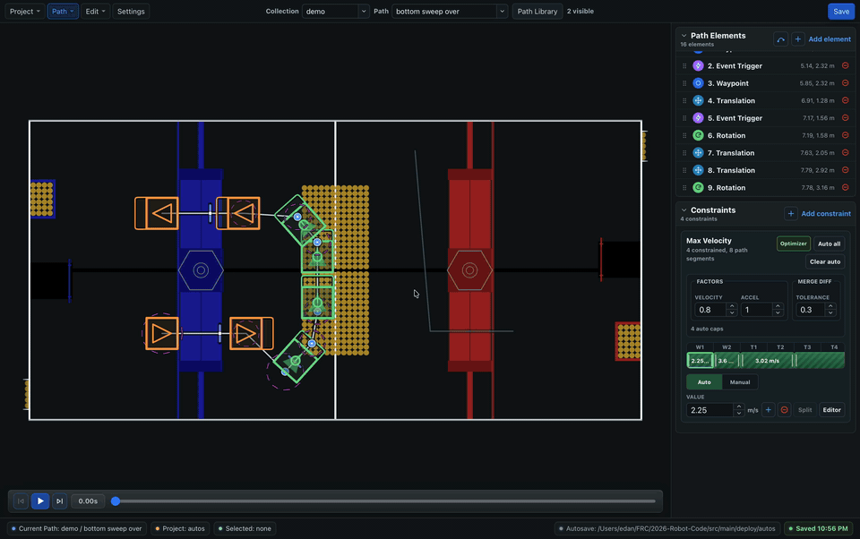
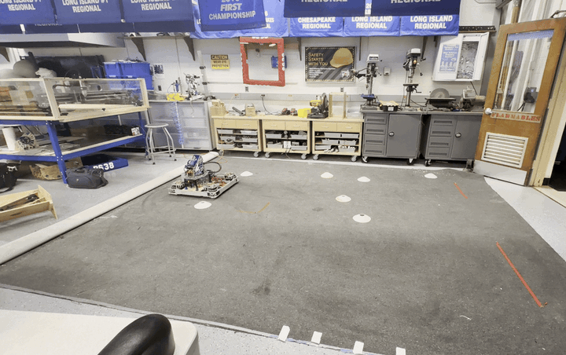

<div align="center">

# BLine Web

Web and desktop editor for creating, tuning, and previewing rapid
point-to-point autonomous paths for FIRST Robotics Competition.

[](https://bline-web.pages.dev/)
[](#project-status)
[](LICENSE)

[Open the hosted app](https://bline-web.pages.dev/) |
[Desktop downloads](#desktop-downloads) |
[BLine-Lib](https://github.com/edanliahovetsky/BLine-Lib) |
[Docs](https://bline-docs.pages.dev/) |
[Chief Delphi](https://www.chiefdelphi.com/t/introducing-bline-a-new-rapid-polyline-autonomous-path-planning-suite/509778)

</div>

<p align="center">
  
  <br>
  
</p>

## Overview

BLine is an open-source autonomous path generation and tracking suite for
FIRST Robotics Competition holonomic drivetrains, made by students for students.
It is built around the kind of path workflow teams actually need during build
season: create a path quickly, run it, observe the robot, tune the constraints,
and iterate again.

BLine Web is the current editor for that workflow. It brings the original
BLine desktop experience to a modern React/Tauri codebase that runs in the
browser and as a desktop app.

The editor is built for rapid iteration: create or open a BLine project, edit
paths on the field, tune translation and rotation constraints, preview the
idealized path simulation, and save/export the same `config.json` plus
`paths/*.json` files used by the BLine robot library.

The streamlined editor starts with an explicit project center instead of
silently creating demo content. In the editor, the field stays central:
canvas tools live on the left, view controls live on the field, element and
constraint editing share a tabbed inspector, and save health is summarized in
one status bar. Use the Project Navigator to search paths and collections or
press `Cmd/Ctrl+K` to find commands without leaving the keyboard. Ranged
constraints can be opened in a larger, draggable editor when the compact
inspector does not provide enough working room.

The goal is not to make autonomous path planning look more complicated than it
has to be. BLine uses practical point-to-point paths, forgiving tuning surfaces,
and visual feedback so teams can get from "we need an auto" to "we can run,
observe, and improve this on the robot" faster.

## Project Status

BLine Web is currently an alpha replacement for the original PySide6
[BLine-GUI](https://github.com/edanliahovetsky/BLine-GUI). Browser and Tauri
desktop workflows are implemented and tested against the existing GUI's core
behavior.

The current app is useful for browser and desktop editing.

## Desktop Downloads

Stable desktop builds:

- [Windows x64](https://bline-metrics.edan-liahovetsky.workers.dev/d/web/stable/windows-x64?source=readme-stable)
- [macOS Apple Silicon](https://bline-metrics.edan-liahovetsky.workers.dev/d/web/stable/macos-aarch64?source=readme-stable)
- [macOS Intel](https://bline-metrics.edan-liahovetsky.workers.dev/d/web/stable/macos-x64?source=readme-stable)
- [Linux x64](https://bline-metrics.edan-liahovetsky.workers.dev/d/web/stable/linux-x64?source=readme-stable)

Pre-release desktop builds:

- [Windows x64](https://bline-metrics.edan-liahovetsky.workers.dev/d/web/prerelease/windows-x64?source=readme-prerelease)
- [macOS Apple Silicon](https://bline-metrics.edan-liahovetsky.workers.dev/d/web/prerelease/macos-aarch64?source=readme-prerelease)
- [macOS Intel](https://bline-metrics.edan-liahovetsky.workers.dev/d/web/prerelease/macos-x64?source=readme-prerelease)
- [Linux x64](https://bline-metrics.edan-liahovetsky.workers.dev/d/web/prerelease/linux-x64?source=readme-prerelease)

Fallback: [GitHub Releases](https://github.com/edanliahovetsky/BLine-Web/releases).

## For Existing BLine Users

BLine Web is meant to preserve the BLine workflow while making the editor easier
to run and distribute. It reads and writes the standard autos folder shape:

```text
autos/
  config.json
  paths/
    my_auto.json
```

In browser mode, projects are stored under the browser origin. Use import/export
to move projects between machines or into robot project folders.

Useful editor shortcuts:

- `Cmd/Ctrl+K`: command palette
- `V`, `1`, `2`, `3`, `4`, `C`: select, waypoint, translation, rotation,
  event, and curve tools
- `J` / Home, `K` / Space, `L` / End: restart, play or pause, and jump to
  the end of the simulation
- Arrow keys: move selection through path elements
- `Shift` + Arrow keys: nudge the selected element on the field
- `Alt` + Arrow keys: reorder the selected path element
- `Cmd/Ctrl+D`: duplicate the selected element
- `Cmd/Ctrl+S`, `Cmd/Ctrl+Z`, `Cmd/Ctrl+Shift+Z`: save, undo, and redo
- `?` or `F1`: keyboard shortcut reference

In Tauri desktop mode:

- selecting an `autos` folder uses it directly;
- selecting an FRC robot repository resolves to `src/main/deploy/autos` when
  that deploy folder exists;
- missing `config.json` and `paths/` structure is created as needed.

Normal save/autosave writes to the editor's selected storage target. Saving a
project is intentionally separate from any robot runtime deployment workflow.

## Quick Start

Use Node `24.6.0`, matching `.node-version`.

```sh
npm ci
npm run dev
```

Open:

```text
http://127.0.0.1:1420/
```

Desktop development shell:

```sh
npm run tauri:dev
```

Production web build:

```sh
npm run build
```

Desktop artifacts:

```sh
npm run tauri:build
```

## Requirements

- Node.js `24.6.0`
- npm, using the committed `package-lock.json`
- Rust stable for Tauri commands and desktop builds
- Playwright Chromium and WebKit for browser E2E tests

Install the Playwright browser dependencies with:

```sh
npx playwright install chromium webkit
```

Linux Tauri builds also require the native WebKit/AppIndicator/Rsvg/Patchelf
packages used by the release workflow.

## Scripts

| Command                         | Purpose                                                 |
| ------------------------------- | ------------------------------------------------------- |
| `npm run dev`                   | Start Vite on `127.0.0.1:1420`                          |
| `npm run lint`                  | Run ESLint over source, tests, and config files         |
| `npm run format`                | Format tracked source and config files with Prettier    |
| `npm run format:check`          | Check Prettier formatting without writing files         |
| `npm run typecheck`             | Run TypeScript project-reference type checks            |
| `npm run test`                  | Run Vitest unit tests                                   |
| `npm run parity`                | Run parity tests against reference fixtures             |
| `npm run validate:bline-lib-io` | Validate generated autos files against BLine-Lib        |
| `npm run test:e2e`              | Run Playwright browser tests                            |
| `npm run build`                 | Typecheck and build the Vite bundle                     |
| `npm run release:check`         | Verify package, Tauri, Cargo, and optional tag versions |
| `npm run tauri:dev`             | Start the Tauri desktop development shell               |
| `npm run tauri:build`           | Build Tauri desktop artifacts                           |

Recommended pre-PR check:

```sh
npm run release:check
npm run lint
npm run format:check
npm run typecheck
npm run test
npm run parity
npm run validate:bline-lib-io
npm run build
npm run test:e2e
```

Run `npm run tauri:build` when desktop behavior or release readiness is in
scope.

`npm run validate:bline-lib-io` requires a BLine-Lib checkout. CI checks out
`edanliahovetsky/BLine-Lib@main` automatically. For local runs outside the
default `/Users/edan/FRC/BLine-Lib` location, set `BLINE_LIB_DIR=/path/to/BLine-Lib`.

## Architecture

```text
src/
  core/       Framework-free model, IO, migrations, constraints, simulation
  state/      Project, selection, history, and autosave stores
  storage/    Browser and Tauri storage adapter implementations
  platform/   Project IO service and shell-facing capability abstraction
  canvas/     PixiJS/WebGL field renderer, layers, geometry, and interactions
  ui/         React app shell, menus, dialogs, sidebar, controls
  env/        Environment capability detection
src-tauri/    Tauri 2 desktop shell and Rust storage commands
parity-harness/
tests/
  unit/
  e2e/
  fixtures/
  manual/
scripts/
```

Boundary rules:

- `src/core` is framework-free and should not import React, PixiJS, browser APIs,
  Tauri APIs, or service code.
- UI and canvas code may depend on state/core; core must not depend on UI or
  canvas.
- Storage behavior should go through adapter/service boundaries rather than
  direct environment checks in UI code.

## For WPILib/FRC Tooling Reviewers

BLine Web is structured to make evaluation straightforward:

- No cloud backend is required for the current browser or desktop editor.
- Core path model, serialization, constraints, and simulation are plain
  TypeScript and testable without React or Tauri.
- Browser and desktop persistence are separated behind storage adapters.
- Project persistence is distinct from robot runtime deployment, so ordinary
  editor autosave is not treated as a robot-code deploy operation.
- Tauri desktop storage maps naturally to FRC robot project folders and
  `src/main/deploy/autos`.

The intended long-term shape is a single editor that can be hosted statically,
bundled as desktop software, or adapted to another FRC tooling environment
without changing the core path-editing logic.

## Testing And QA

The automated suite is layered by risk:

- ESLint and TypeScript for static checks.
- Vitest for core, storage, state, canvas helpers, and UI command behavior.
- Playwright for browser-visible app shell and interaction flows.
- `parity-harness/` for behavior that must stay aligned with the existing
  desktop reference.
- Tauri build/smoke checks for desktop packaging and storage behavior.

The parity harness focuses on high-value drift risks:

- legacy project/schema round-trip stability;
- native path serializer ranged-constraint ordinal stability;
- deterministic simulation output for a dense reference fixture.

Manual smoke notes live under `tests/manual/`.

## Release Model

`main` is the stable working branch. It should stay green, but it does not
deploy to Cloudflare and does not create desktop release artifacts.

`web-deploy` is the public release branch. Cloudflare Pages should be configured
with:

```text
Build command: npm run build
Output directory: dist
Node version: 24.6.0
```

Every push to `web-deploy` runs the release gate, builds the Vite web bundle,
builds Tauri desktop artifacts for testers, and creates or updates a
draft GitHub Release named from `package.json`, for example
`v0.1.0-alpha.1`.
The generated draft release notes include BLine Metrics Worker redirect links
for the exact release tag, the stable channel, and the pre-release channel,
plus an attached asset checklist for the web bundle and desktop platform
artifacts.

Promotion is explicit: merge or push a tested commit to `web-deploy` only when
it is ready for the public Cloudflare site and draft desktop release artifacts.
Cloudflare hosts the website; stable and pre-release desktop installers are
available through the [desktop download links](#desktop-downloads), with
[GitHub Releases](https://github.com/edanliahovetsky/BLine-Web/releases) as a
direct fallback.

Version metadata must stay aligned across:

- `package.json`
- `src-tauri/tauri.conf.json`
- `src-tauri/Cargo.toml`

Use `npm run release:check` to verify that alignment.

## Related Projects

- [BLine-Lib](https://github.com/edanliahovetsky/BLine-Lib): Java robot library.
- [BLine-GUI](https://github.com/edanliahovetsky/BLine-GUI): original PySide6
  desktop editor.
- [BLine Docs](https://bline-docs.pages.dev/): user-facing
  documentation for the BLine ecosystem.
- [Chief Delphi thread](https://www.chiefdelphi.com/t/introducing-bline-a-new-rapid-polyline-autonomous-path-planning-suite/509778):
  discussion, feedback, and announcements.

## License

BLine Web is licensed under the BSD 3-Clause License. See
[`LICENSE`](LICENSE).
